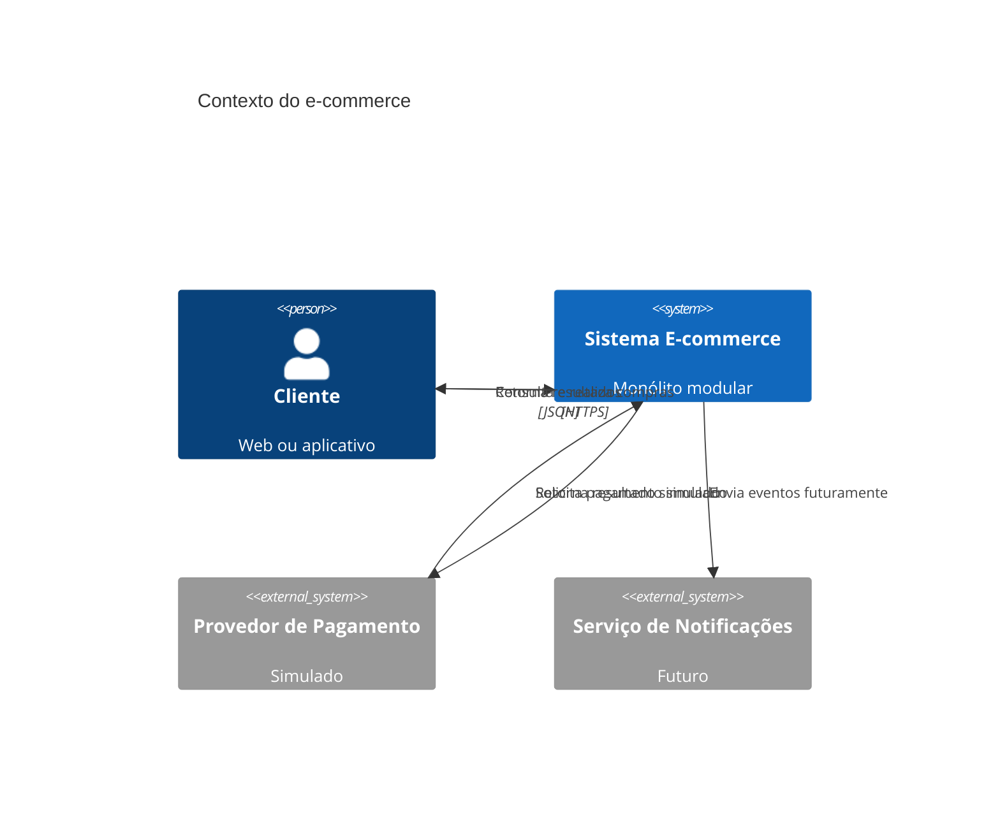

# C4 — Contexto

O provedor é uma integração simulada planejada; notificações são futuras.

```mermaid
C4Context
    title Contexto do e-commerce
    Person(cliente, "Cliente", "Web ou aplicativo")
    System(ecommerce, "Sistema E-commerce", "Monólito modular")
    System_Ext(pagamento, "Provedor de Pagamento", "Simulado")
    System_Ext(notificacoes, "Serviço de Notificações", "Futuro")
    Rel(cliente, ecommerce, "Consulta e realiza compras", "HTTPS")
    Rel(ecommerce, cliente, "Retorna resultados", "JSON")
    Rel(ecommerce, pagamento, "Solicita pagamento simulado")
    Rel(pagamento, ecommerce, "Retorna resultado simulado")
    Rel(ecommerce, notificacoes, "Envia eventos futuramente")
```
