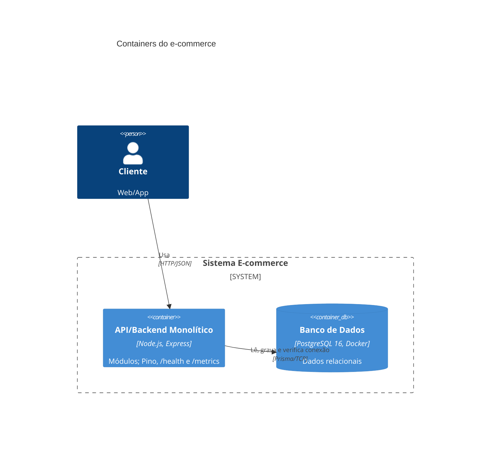

# C4 — Containers

Um processo de API agrupa os módulos e a observabilidade. O Postgres executa em container Docker separado.

```mermaid
C4Container
    title Containers do e-commerce
    Person(cliente, "Cliente", "Web/App")
    System_Boundary(sistema, "Sistema E-commerce") {
        Container(api, "API/Backend Monolítico", "Node.js, Express", "Módulos; Pino, /health e /metrics")
        ContainerDb(db, "Banco de Dados", "PostgreSQL 16, Docker", "Dados relacionais")
    }
    Rel(cliente, api, "Usa", "HTTP/JSON")
    Rel(api, db, "Lê, grava e verifica conexão", "Prisma/TCP")
```
